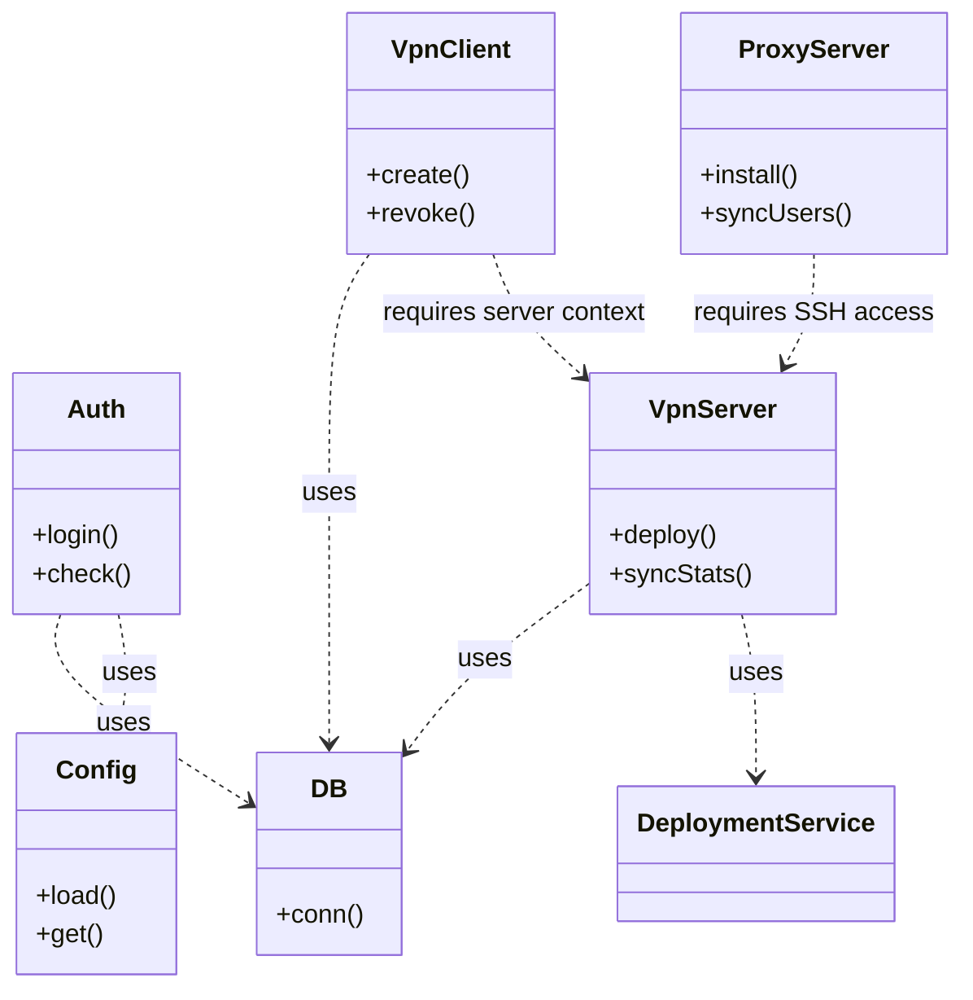

[[../index|Global Index]] → [[index|01 Architecture]] → [[Internal Module Relationships]]

# Internal Module Relationships

This document details how the various modules within NK-Core interact and depend on each other.

## 🤝 Core Dependencies

### Data Flow Pattern
1. **HTTP Layer** (`controllers/`) depends on **Service Layer** (`inc/`).
2. **Service Layer** (`inc/`) depends on **Utility Layer** (`inc/DB.php`, `inc/Config.php`).
3. **Frontend Layer** (`templates/`) depends on **View Engine** (`inc/View.php`).

### Class Relationship Diagram

## 🔗 Critical Coupling

### `VpnServer` and `VpnClient`
These are the most tightly coupled modules. A `VpnClient` cannot exist without a valid `VpnServer`. When a client is created or revoked, the `VpnClient` class uses the `VpnServer` instance to execute commands on the remote node via its established SSH connection.

### `VpnServer` and `ProxyServer`
The `ProxyServer` class utilizes the orchestration capabilities of `VpnServer`. It reuses the server's host data and SSH connection logic to install and manage proxy containers.

### `Auth` and `JWT`
`JWT` authentication is an extension of the `Auth` system. While `Auth` handles session-based state, `JWT` uses the same user database and `Auth::getUserByEmail` logic to verify identities for API tokens.

## 📦 Shared Utilities
- **`Translator`**: Used by every controller and the `View` engine to localize output.
- **`CSRF`**: Used globally in `index.php` to protect all state-changing routes.
- **`S3Lite`**: Primarily used by `BackupManager` but available for any module requiring remote storage.

---
- ⬅️ Previous: [[Service Architecture]]
- ➡️ Next: [[../02_backend/index|02 Backend]]
- 📍 Parent: [[index|01 Architecture]]
- 🔗 Related:
  - [[System Architecture]]
  - [[Service Architecture]]
  - [[../02_backend/Controller Reference|Controller Reference]]

