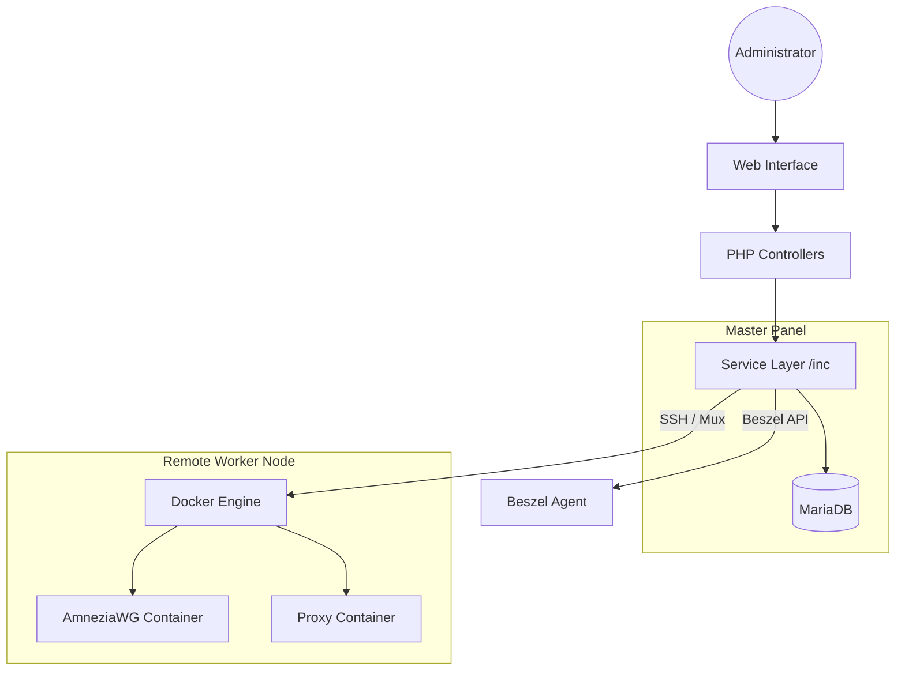

[[../index|Global Index]] → [[index|01 Architecture]] → [[System Architecture]]

# System Architecture

NK-Core is designed as a **Centralized Control Plane** for distributed VPN infrastructure. It follows a hub-and-spoke model where a single master panel manages multiple worker nodes (VPN/Proxy servers).

## 🏗️ High-Level Design

## 🧩 Core Components

### 1. Control Plane (Master Panel)
- **Routing Hub**: Handles HTTP/REST requests and dispatches them to controllers.
- **State Engine**: Manages the lifecycle of servers and clients in the database.
- **Orchestrator**: Uses SSH to provision and control remote nodes.

### 2. Worker Nodes (Data Plane)
- **Containerized Services**: VPN (AmneziaWG) and Proxy services are isolated in Docker.
- **Host Dependencies**: Minimal requirements (Docker, SSH, Kernel headers for AWG).
- **Security**: Hardened via `iptables` and limited exposure of internal ports.

### 3. Service Layer (`inc/`)
- **VpnServer**: Encapsulates remote node orchestration, SSH multiplexing, and Docker management.
- **VpnClient**: Handles peer configuration generation and status tracking.
- **Auth/JWT**: Provides dual-mode authentication (Session for Web, JWT for API).

## 📡 Communication Model
- **Master to Node**: SSH Multiplexing (`ControlMaster`). This allows the panel to execute multiple commands on a remote node without the overhead of repeated handshakes.
- **Node to Master**: Passive. The Master polls the nodes for stats; nodes do not initiate connections to the Master.
- **Client to Node**: Standard VPN protocols (WireGuard/AWG) or SOCKS5/HTTP proxies.

## 🔄 Interaction Patterns
1. **Provisioning**: Master Panel SSHs into a fresh server -> Installs Docker -> Builds AWG Image -> Starts Container.
2. **Client Creation**: Master generates keypair -> Updates config on remote node via SSH -> Returns config to user.
3. **Monitoring**: Periodic cron/AJAX triggers Master to SSH into node -> Runs `awg show` / `docker stats` -> Updates local DB.

---
- ⬅️ Previous: [[index|01 Architecture]]
- ➡️ Next: [[Service Architecture]]
- 📍 Parent: [[index|01 Architecture]]
- 🔗 Related:
  - [[Service Architecture]]
  - [[Internal Module Relationships]]
  - [[../09_infrastructure/Infrastructure Overview|Infrastructure Overview]]

