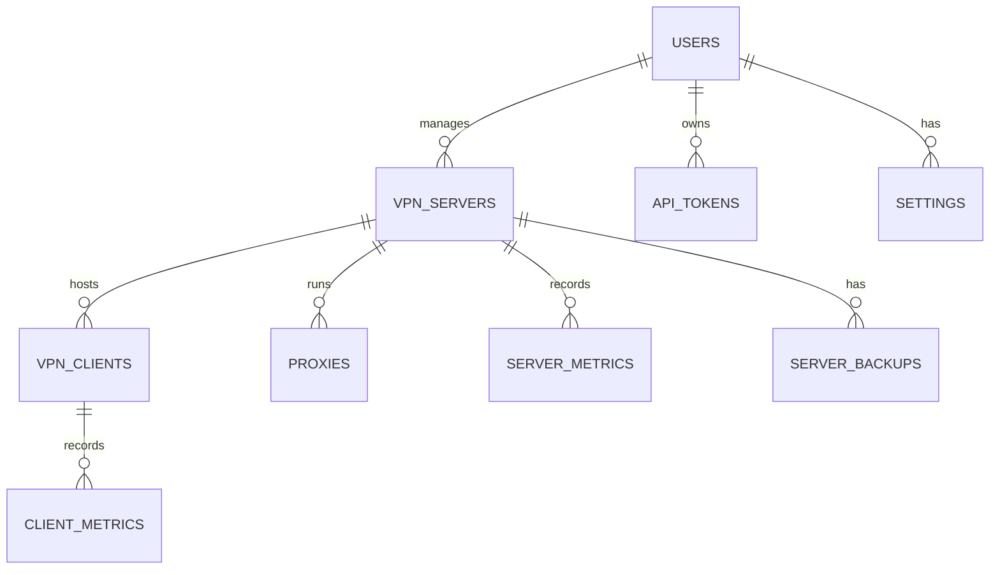

[[../index|Global Index]] → [[index|04 Database]] → [[Database Schema]]

# Database Schema

NK-Core uses a relational database (MariaDB/MySQL) to store system state, configuration, and historical metrics. This document defines the source-of-truth schema for all core tables.

> [!NOTE]
> As of the PHP 8.5 upgrade, statuses and roles are managed via native PHP Enums (`inc/Enums.php`).

## 📊 Entity Relationship Diagram (Conceptual)

## 🗄️ Core Tables

### `users`
Stores identity and access control data.
- `id`: Primary Key (INT UNSIGNED).
- `email`: Unique login identifier (VARCHAR 255).
- `password_hash`: Bcrypt hashed password.
- `role`: **Enum** (`admin`, `user`). Managed by `UserRole` Enum.
- `preferred_language`: Default UI language for the user.
- `status`: `active` or `disabled`.
- `created_at`: Registration timestamp.
- `last_login_at`: Last successful authentication.
- `deleted_at`: Soft-delete timestamp.

### `vpn_servers`
Metadata and orchestration details for remote nodes.
- `id`: Primary Key (INT UNSIGNED).
- `user_id`: Owner of the server.
- `name`: Human-readable identifier.
- `host`: IP address or domain of the remote node.
- `port`: SSH connectivity port (usually 22).
- `username`, `password`: SSH credentials.
- `ssh_private_key`: Optional private key for auth.
- `container_name`: Docker container name (defaults to `nk-awg-v2`).
- `vpn_port`: UDP port used by AmneziaWG.
- `vpn_subnet`: Virtual subnet (e.g., `10.8.1.0/24`).
- `server_public_key`, `server_private_key`: WireGuard/AWG keypair.
- `preshared_key`: Optional static key for all peers.
- `awg_params`: JSON blob of AmneziaWG mimicry parameters (Jc, Jmin, Jmax, S1-S4, H1-H4).
- `status`: **Enum** (`active`, `deploying`, `stopped`, `error`, `deleted`). Managed by `ServerStatus` Enum.
- `last_ping_ms`: Latency to the node.
- `deployed_at`: Initial setup completion time.
- `last_check_at`: Last health check execution.
- `error_message`: Details if status is `error`.
- `deleted_at`: Soft-delete timestamp.

### `vpn_clients`
Configuration and state for VPN peers.
- `id`: Primary Key (INT UNSIGNED).
- `server_id`: Foreign Key to `vpn_servers`.
- `user_id`: Owner of the client.
- `name`: Client identifier (e.g., "iPhone-Work").
- `client_ip`: Virtual IP within the server's subnet.
- `public_key`, `private_key`: Peer keypair.
- `preshared_key`: Optional static key.
- `config`: Full generated `.conf` text.
- `bytes_sent`, `bytes_received`: Historical traffic counters.
- `last_handshake`: Last successful connection time.
- `last_sync_at`: Last time metrics were pulled from the server.
- `status`: **Enum** (`active`, `disabled`, `deleted`). Managed by `ClientStatus` Enum.
- `expires_at`: Expiration timestamp (NULL = permanent).
- `external_ip`: Last known real IP of the client.
- `ip_country`, `ip_city`, `ip_isp`: Geolocation data.
- `deleted_at`: Soft-delete timestamp.

### `proxies`
Instances of SOCKS5 or HTTP proxies.
- `id`: Primary Key (INT UNSIGNED).
- `server_id`: Foreign Key to `vpn_servers`.
- `type`: **Enum** (`socks5`, `http`). Managed by `ProxyType` Enum.
- `port`: External proxy port.
- `username`, `password`: Proxy authentication credentials.
- `status`: `active`, `paused`, `deleted`.

### `server_backups`
Registry of backup archives stored on local or remote storage.
- `id`: Primary Key.
- `server_id`: Source server.
- `backup_name`: Filename/Identifier.
- `backup_path`: Absolute path or S3 key.
- `backup_size`: Size in bytes.
- `clients_count`: Number of peers included.
- `backup_type`: `manual` or `automatic`.
- `status`: `creating`, `completed`, `failed`.

### `api_tokens`
Tokens for programmatic access.
- `id`: Primary Key.
- `user_id`: Token owner.
- `token`: Hashed/Secure token string.
- `name`: Token identifier.
- `last_used_at`: Last activity timestamp.
- `expires_at`: Validity period.
- `revoked_at`: Manual revocation timestamp.

### `settings`
Unified JSON-based storage for system and user-specific configurations.
- `user_id`: NULL for global, INT for user-specific.
- `namespace`: Grouping (e.g., `backups`, `notifications`).
- `key`: Setting identifier.
- `value`: JSON blob.

### `translations`
Multi-language support table.
- `language_code`: `en`, `ru`, `uk`, etc.
- `translation_key`: Unique string identifier (e.g., `menu.dashboard`).
- `translation_value`: Translated text.

## 🔄 Migrations
- **Location**: `/migrations/`
- **Format**: Sequential SQL files (e.g., `001_init.sql`, `011_add_soft_delete_to_clients.sql`).
- **State Tracking**: Implicit execution during system bootstrap; the system verifies schema versioning against the latest migration file.

---
- ⬅️ Previous: [[index|04 Database]]
- ➡️ Next: [[../05_api/index|05 API]]
- 📍 Parent: [[index|04 Database]]
- 🔗 Related:
  - [[../10_workflows/Data Flow|Data Flow]]
  - [[../02_backend/Core Classes|Core Classes]]
