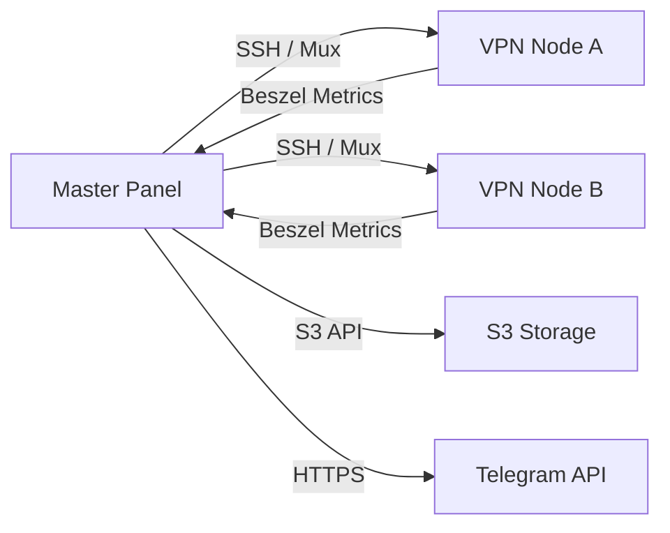

[[../index|Global Index]] → [[index|09 Infrastructure]] → [[Infrastructure Overview]]

# Infrastructure Overview

NK-Core is designed to be highly portable yet capable of managing complex, distributed network infrastructure.

## 🏗️ Deployment Topology

## 🖥️ Master Panel
The Master Panel is the central brain of the system. It can be hosted on a small VPS (1 vCPU, 2GB RAM).
- **Runtime**: PHP 8.1+ with FPM.
- **Web Server**: Nginx with optimized `fastcgi_params`.
- **Database**: MariaDB 10.6+ with JSON column support.
- **Storage**: Local filesystem for logs/cache; S3 for backups.

## 🌐 Worker Nodes (VPN Servers)
Distributed servers that handle actual traffic.
- **OS**: Ubuntu 22.04+ or Debian 11+ recommended.
- **Core Engine**: Docker Engine.
- **Services**:
  - **AWG Container**: High-performance AmneziaWG VPN.
  - **Proxy Container**: Optional HTTP/SOCKS5 proxy.
  - **Beszel Agent**: Lightweight system monitoring.
- **Networking**: Requires at least one public IPv4 address and UDP port openness.

## 📦 Containerization Strategy
- **NK-Core App**: Containerized for easy scaling and updates.
- **VPN Service**: Isolated in a `--privileged` container to allow interaction with host `tun` devices and `iptables`.
- **Database**: Can be hosted locally on the Master or as a managed service.

## 🛡️ Networking & Connectivity
- **SSH Multiplexing**: The Master Panel establishes persistent SSH connections to nodes to minimize the overhead of frequent polling and command execution.
- **Dynamic Routing**: The panel automatically configures `iptables` and `sysctl` on nodes to enable IP forwarding and NAT for VPN clients.
- **MTU Management**: MTU is clamped to 1280 by default to ensure compatibility across diverse network paths and avoid fragmentation.

## ☁️ Cloud Integrations
- **S3 (Backups)**: Supports any S3-compatible provider (AWS, DigitalOcean Spaces, MinIO).
- **Telegram (Alerts)**: Uses a standard Telegram Bot to notify admins of system events.
- **Beszel (Monitoring)**: Provides a visual dashboard for node health within the NK-Core interface.

---
- ⬅️ Previous: [[index|09 Infrastructure]]
- ➡️ Next: [[Background Jobs & Async Processing]]
- 📍 Parent: [[index|09 Infrastructure]]
- 🔗 Related:
  - [[../01_architecture/System Architecture|System Architecture]]
  - [[../08_deployment/Deployment Guide|Deployment Guide]]
  - [[Background Jobs & Async Processing]]

